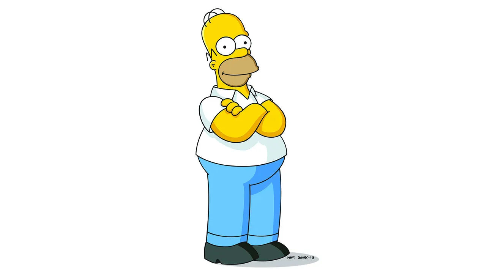
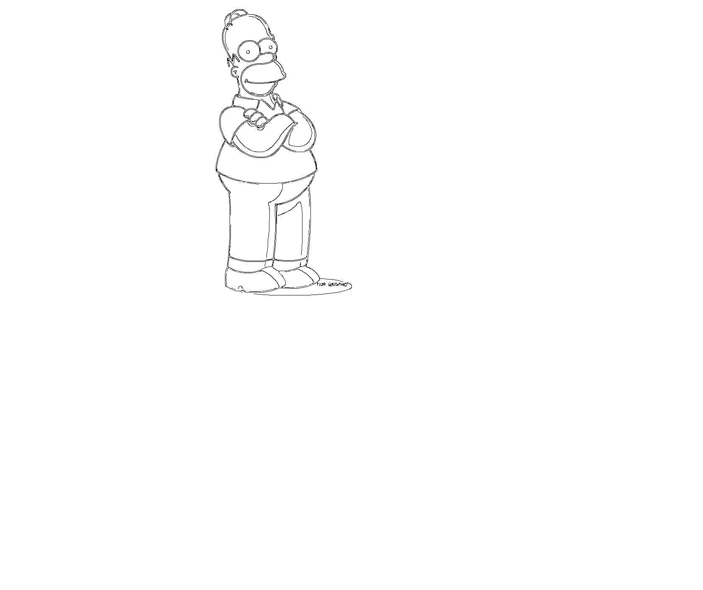
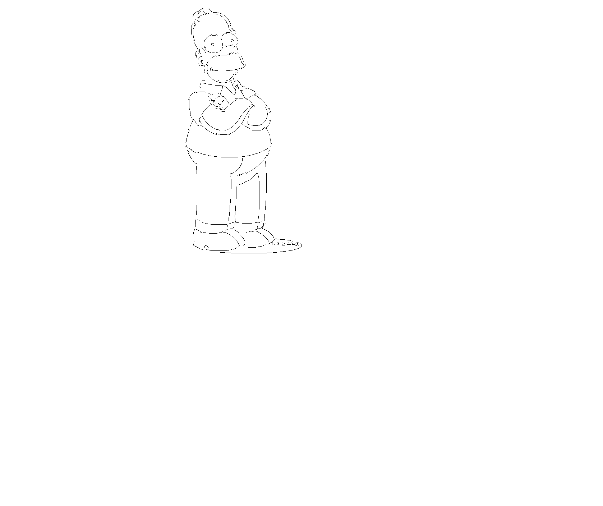

**IMAGE VECTORIZATION AND CURVE REDUNDANCY REMOVAL**

This Application processes any raw image and interprets the contents of the image's edges. It attempts to reconstruct the edges as LINES or CUBIC BEZIER CURVES.
Typically, raw images have edges with non-zero edge thickness because the images are drawn either by pen/pencil or digital paintbrush. Thus, edge detection is performed on the image, we get 2 sets of redundant curves that actually denote the same edge.
Thus, this application does the following:
1) Perform Canny edge detection on the image to determine the edges of an image
2) Crawl through the contours generated by the Canny Edge detector. For each contour, break down the segments into lines.
3) Once the contour from the image has been broken down into lines, push this lines into a grid to determine which lines are redundant. This allows the program to run in a reasonable amount of time and avoid O(N^2) lookup
4) Once the redundant lines are detected, remove the redundant lines

TODO: Have noticed that with especially noisy images, all of the segments from a portion get removed. Working on combining lines into LINES or CUBIC BEZIER CURVES. Thus, may also need to align the curves as redundant lines are removed.

For example - this is a input test image of Homer Simpson

If only edge detection was performed on the image, we would see redundant curves on the image because the line drawing the figure has a certain width

With the breaking down of the contiguous segments into LINES and removing the redundant cruves, can see the same image except the curves are now clearly defined by 1 set of curves and can be used by further tools downstream

